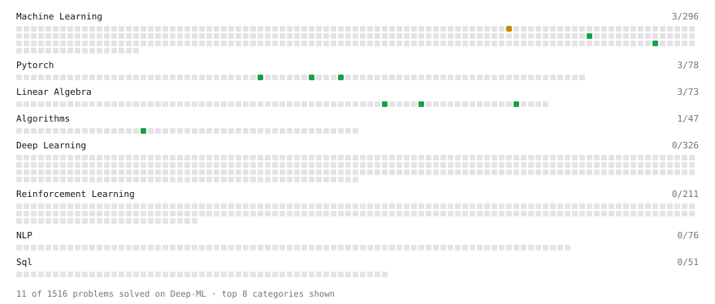

# Deep-ML

My machine learning practice from [Deep-ML](https://www.deep-ml.com). Every solution here was written by hand.

**8** solved · 8 problems · 0 labs · 0 math

[**Browse the interactive portfolio**](https://HarshEkbote.github.io/deep-ml/) to replay this filling in over time.

## Problems

| | Difficulty | Solved | |
| --- | --- | --- | --- |
| [First N Fibonacci Numbers](https://www.deep-ml.com/problems/1151) | easy | 2026-09-29 | [solution](problems/1151-first-n-fibonacci-numbers) |
| [Handle Missing Data in pandas (dropna/fillna)](https://www.deep-ml.com/problems/1128) | easy | 2026-09-30 | [solution](problems/1128-handle-missing-data-in-pandas-dropna-fillna) |
| [L2 Normalization Along an Axis](https://www.deep-ml.com/problems/1022) | easy | 2026-09-22 | [solution](problems/1022-l2-normalization-along-an-axis) |
| [Smooth L1 Loss with a Beta Parameter](https://www.deep-ml.com/problems/1372) | easy | 2026-09-23 | [solution](problems/1372-smooth-l1-loss-with-a-beta-parameter) |
| [Tensor Puzzle: Extract the Diagonal](https://www.deep-ml.com/problems/1271) | easy | 2026-09-24 | [solution](problems/1271-tensor-puzzle-extract-the-diagonal) |
| [Tensor Puzzle: Linspace from Endpoints](https://www.deep-ml.com/problems/1285) | easy | 2026-09-28 | [solution](problems/1285-tensor-puzzle-linspace-from-endpoints) |
| [Top Quartile Reward Score Filter](https://www.deep-ml.com/problems/778) | easy | 2026-09-21 | [solution](problems/0778-top-quartile-reward-score-filter) |
| [Implement ROC Curve Calculation](https://www.deep-ml.com/problems/276) | medium | 2026-09-16 | [solution](problems/0276-implement-roc-curve-calculation) |

---

_This file is regenerated by Deep-ML on every push._
